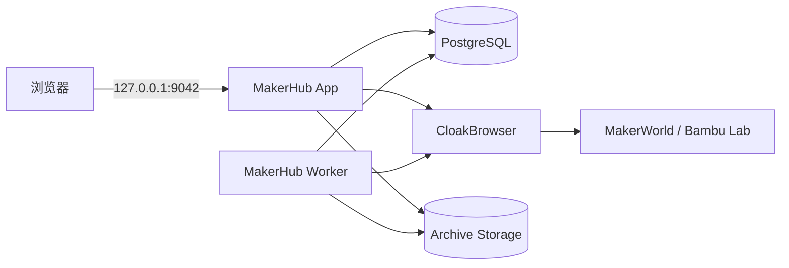

<p align="center">
  
</p>

<h1 align="center">MakerHub</h1>

<p align="center">
  <strong>把 MakerWorld 收藏、模型与 3MF 变成真正属于自己的私人模型库。</strong>
</p>

<p align="center">
  自托管 · 收藏夹批量归档 · 自动订阅 · 3MF 下载 · 本地模型管理 · 私有数据优先
</p>

<p align="center">
  <a href="https://github.com/Sacilave/makerhub/actions/workflows/docker.yml"></a>
  
  
  
</p>

---

## MakerHub 是什么？

MakerHub 是一个面向 **MakerWorld / Bambu Lab 用户**的自托管 3D 模型归档与管理系统。

它解决的不是“下载一个模型”，而是更长期的问题：

- 收藏夹越来越大，希望一次性完整备份；
- 担心模型、打印配置或附件以后被删除；
- 希望自动跟踪收藏夹、作者与合集中的新增模型；
- 希望把模型、图片、附件、评论、打印配置和 `3MF` 放进自己的 NAS / 硬盘；
- 希望以后不依赖浏览器收藏页，也能快速搜索和管理自己的模型库；
- 希望国内站与国际站都能使用真实浏览器登录态，而不是把账号密码交给脚本保存。

MakerHub 会把 **MakerWorld 作为来源**，把你的本地存储作为最终归档目标。

```text
MakerWorld / Bambu Lab
        │
        │  收藏夹 / 作者 / 合集 / 单模型
        ▼
   CloakBrowser 登录态
        │
        ▼
      MakerHub
   ┌────┼───────────────┐
   │    │               │
   ▼    ▼               ▼
模型信息 3MF / 附件     图片 / 评论
   │    │               │
   └────┴───────┬───────┘
                ▼
        自己的 NAS / 硬盘
```

---

## 主要能力

### 📦 MakerWorld 完整归档

MakerHub 可以处理：

- 单个模型；
- 作者模型列表；
- 自己的 MakerWorld 收藏夹；
- 收藏夹中的多个子收藏；
- 关注的合集；
- 批量模型来源。

归档内容根据源端实际可用数据保存，包括：

- 模型元数据；
- 模型封面与图片；
- 附件；
- 评论；
- Print Profile / 打印配置；
- 可下载的 `3MF`；
- 来源 URL 与本地 `meta.json`。

对于仅允许平台打印、已经下架、私有、需要验证或达到下载额度的模型，任务不会简单地把“没下载到”误判为成功，而是保留对应状态供后续恢复。

### ❤️ 收藏夹批量备份

MakerHub 会读取账号收藏来源并发现其中的模型。

收藏发现不是只依赖单一旧接口，而是结合 MakerWorld 页面数据、当前 API 与 fallback 策略，并对“页面总数”和“实际发现数量”做完整性判断。

这意味着它更适合这样的场景：

> **“我有几百个收藏，不想一个一个下载，希望一次完整备份并以后继续同步。”**

### 🔄 自动订阅

你可以把来源保存为订阅：

- 收藏夹；
- 作者；
- 合集；
- 其他支持的 MakerWorld 来源。

后台 Worker 会定期重新发现模型，并将新增内容送入统一归档队列。

### 🧩 私人模型库

归档完成后，MakerHub 不只是一个下载脚本。

Web UI 可以用于：

- 搜索模型；
- 浏览模型卡片；
- 查看归档状态；
- 管理本地文件；
- 标记收藏 / 已打印；
- 查看任务；
- 修复缺失 3MF；
- 管理来源和订阅。

### 📁 本地模型导入

除了 MakerWorld，MakerHub 也可以整理自己的本地模型文件，例如：

- `.3mf`
- `.stl`
- `.step`
- `.obj`
- 压缩包
- 图片与附件

这样 MakerWorld 下载模型和自己保存的模型可以进入同一个本地资料库。

### 🌏 国内站与国际站

MakerWorld 国内站和国际站使用独立的浏览器 Profile：

```text
makerworld.com.cn  → CN Profile
makerworld.com     → Global Profile
```

两边的 Cookie、登录状态和站点验证互不混用。

---

# 架构

默认部署由四个服务组成：

| 服务 | 作用 |
| --- | --- |
| `makerhub-app` | Web UI、FastAPI、鉴权、配置、模型浏览和任务提交 |
| `makerhub-worker` | 归档任务、订阅、刷新、整理、缺失 3MF 修复、后台维护 |
| `makerhub-postgres` | 配置、任务状态、索引、Session、业务日志 |
| `makerhub-cloakbrowser` | 保存 MakerWorld 浏览器 Profile，并执行需要真实浏览器登录态的请求 |



更完整的边界设计见 [Architecture](docs/ARCHITECTURE.md)。

---

# 快速安装

## 推荐：直接下载 Release

如果只是使用 MakerHub，不需要克隆源码。Release 提供两种固定架构的可运行包：

| 平台 | Release 文件 | 运行环境 |
| --- | --- | --- |
| Windows x86-64 / amd64 | `makerhub-windows-amd64.zip` | Windows 10/11 64 位 + Docker Desktop（WSL2） |
| Linux x86-64 / amd64 | `makerhub-linux-amd64.tar.gz` | 64 位 Linux + Docker Engine + Compose v2 |

每个 Release 包都固定到**通过同一轮完整 E2E Gate 的不可变容器 digest**，Windows 与 Linux 不维护两套不同的 MakerHub 后端，因此功能和数据格式保持一致。

Windows 解压后：

```powershell
.\makerhub.ps1 start
```

Linux 解压后：

```bash
chmod +x makerhub.sh
./makerhub.sh start
```

启动器会自动完成：

```text
检查 CPU / Docker / Compose
        ↓
生成 PostgreSQL / CloakBrowser 随机凭据
        ↓
生成 AES-256 状态加密主密钥
        ↓
拉取当前 Release 固定的容器 digest
        ↓
启动 App / Worker / PostgreSQL / CloakBrowser
        ↓
等待 readiness
        ↓
显示首次管理员密码
        ↓
打开 http://127.0.0.1:9042
```

常用维护命令：

```text
start
stop
restart
status
logs
doctor
password
update
```

其中 `doctor` 会检查 Docker、Compose、App readiness、Worker heartbeat、PostgreSQL 和 CloakBrowser 网络连通性。

正式 Release 不是“构建成功就发布”。候选版本需要先通过完整 Compose E2E；在真人 MakerWorld 登录场景下，还要对准备发布的 exact commit 执行只读收藏预扫描 Canary，并把生成的 `source_commit` 与 Release workflow 的 `GITHUB_SHA` 对齐。

> Release 的 `update` 只会重新拉取当前版本固定的镜像，不会静默跨版本升级。

### Release 跨版本升级

Release 默认把 `data/`、`.env` 和 `secrets/` 放在**当前实例目录**。跨版本升级时不要把新压缩包当成一个全新的实例直接启动，否则会得到一套新的空数据目录和新密钥。

推荐方式：

1. 停止旧实例：`makerhub.ps1 stop` 或 `./makerhub.sh stop`；
2. 备份旧目录中的 `.env`、`secrets/` 和 `data/`；
3. 将新 Release 中的 `compose.yaml` 与平台启动器覆盖到**原实例目录**；
4. 保留原来的 `.env`、`secrets/`、`data/` 不变；
5. 运行 `start`，然后执行 `doctor`。

如果希望每个 Release 文件夹彼此独立，则应在 `.env` 中把四个数据路径设置为固定的绝对目录。这样更换 Release 文件夹时仍然会使用同一份数据库、归档与 CloakBrowser Profile。

---

## 从源码运行

## 准备环境

推荐：

- Docker Engine / Docker Desktop
- Docker Compose v2
- Git
- Python 3（只用于生成本地随机密钥；没有也可以手动生成）

适合部署在：

- Linux NAS
- Synology DSM
- Unraid
- Ubuntu / Debian Server
- Windows + Docker Desktop
- macOS + Docker Desktop

> MakerHub 是长期运行型归档服务，NAS / Linux 主机通常是最合适的部署位置。

---

## 1. 克隆项目

```bash
git clone https://github.com/Sacilave/makerhub.git
cd makerhub
```

---

## 2. 生成本地密钥

推荐直接运行：

```bash
python scripts/bootstrap_secrets.py
```

它会生成：

```text
.env
secrets/
├── state-encryption-key
└── state-encryption-previous-keys
```

生成器是**幂等的**：已有文件不会被覆盖。

其中：

- `.env` 保存 PostgreSQL 密码、CloakBrowser 控制令牌等实例配置；
- `state-encryption-key` 是 32 字节 AES 状态加密主密钥；
- `state-encryption-previous-keys` 只在轮换密钥时临时使用。

这些文件都被 `.gitignore` 排除。

> **不要把 `secrets/state-encryption-key` 上传到 GitHub，也不要丢失它。**

---

## 3. 启动

```bash
docker compose up -d --build
```

查看状态：

```bash
docker compose ps
```

查看日志：

```bash
docker compose logs -f makerhub-app makerhub-worker
```

---

## 4. 打开 MakerHub

默认地址：

```text
http://127.0.0.1:9042
```

默认只绑定 `localhost`，同一局域网的其他设备默认无法直接访问。

新实例会生成管理员一次性密码：

```bash
docker compose exec makerhub-app \
  cat /app/config/state/admin-bootstrap-password
```

用户名：

```text
admin
```

登录后建议立即修改密码。

---

# 登录 MakerWorld

进入：

```text
设置 → 线上账号
```

选择需要的区域：

- 国内站；
- 国际站。

然后打开对应 CloakBrowser 窗口，**在真实 MakerWorld / Bambu Lab 页面中完成登录**。

MakerHub 的设计是：

```text
你本人在浏览器登录
        ↓
CloakBrowser Profile 保存会话
        ↓
MakerHub 复用现有登录态
```

而不是让后台脚本长期保存一份账号明文密码。

如果 MakerWorld 出现：

- Cloudflare；
- 418；
- Captcha；
- “Verify you are human”；
- 下载前安全验证；

优先在浏览器里人工完成验证，再让任务继续。

---

# 备份自己的收藏夹

登录成功后，可以从账号收藏来源创建归档 / 订阅任务。

推荐第一次执行时先观察三组数字：

```text
源端总数
实际发现数
最终入库数
```

例如：

```text
收藏夹：463
已发现：463
已归档：457
需处理：6
```

剩余项目可能属于：

- 源端明确禁止下载 3MF；
- 模型已下架；
- 模型设为私有；
- 当前账号没有权限；
- MakerWorld 下载额度到达上限；
- 登录 Cookie 失效；
- 需要重新完成人机验证；
- 临时网络错误。

不要把“463 个收藏”理解成“一定存在 463 个合法可下载的 3MF”。MakerHub 会尽量区分这些状态，而不是绕过平台权限。

---

# 数据保存在哪里？

默认目录：

```text
data/
├── archive/        # 3MF、图片、附件、本地模型等
├── cloakbrowser/   # MakerWorld 浏览器 Profile
├── config/         # 运行状态与兼容配置
└── postgres/       # PostgreSQL 数据

secrets/
├── state-encryption-key
└── state-encryption-previous-keys
```

如果你使用 NAS，可以通过 `.env` 改为自己的目录：

```env
MAKERHUB_CONFIG_PATH=/volume1/docker/makerhub/config
MAKERHUB_ARCHIVE_PATH=/volume1/3d/makerhub
MAKERHUB_POSTGRES_DATA_PATH=/volume1/docker/makerhub/postgres
MAKERHUB_CLOAKBROWSER_DATA_PATH=/volume1/docker/makerhub/cloakbrowser
```

App 与 Worker 必须指向同一份配置和归档目录。

---

# 数据与安全

MakerHub 会接触 MakerWorld 登录态，因此安全边界不能只依赖一个 Web 密码。

默认 Compose 采用以下策略：

### Web UI 默认只监听本机

```text
127.0.0.1:9042
```

不会默认开放到整个局域网。

需要 LAN 访问时再显式设置：

```env
MAKERHUB_BIND_ADDRESS=192.168.1.20
```

如果要远程访问，更推荐 VPN / Tailscale / WireGuard，而不是直接把端口暴露公网。

### CloakBrowser Manager 默认只监听本机

```text
127.0.0.1:9050
```

如果 MakerHub 跑在 NAS、你需要在另一台电脑操作登录窗口，再设置：

```env
MAKERHUB_CLOAKBROWSER_BIND_ADDRESS=192.168.1.20
MAKERHUB_CLOAKBROWSER_PUBLIC_URL=http://192.168.1.20:9050
```

同时应限制防火墙来源。

### PostgreSQL 不直接连接外网

数据库只连接 Docker `backend` internal network。

App、Worker 与 CloakBrowser 另外拥有 egress 网络用于正常访问 MakerWorld。

### 敏感 State 使用 AES-256-GCM

以下类型的敏感持久化状态会经过统一加密边界后再写入 PostgreSQL，例如：

- App 配置中的 MakerWorld Cookie / Token；
- Web Session 状态；
- 登录失败状态；
- 分享相关敏感状态；
- 账号 Cookie 来源状态。

数据库中保存的是带认证的 AES-GCM envelope，而不是直接把整个配置对象以明文 JSON 保存。

大型归档队列仍保持 JSONB，因为 Worker 需要 PostgreSQL 在服务端直接统计任务状态。

### Docker Socket 不挂载

标准部署不会把：

```text
/var/run/docker.sock
```

交给 Web 应用。

这避免为了“一键更新”而让应用间接获得宿主机 Docker 控制能力。

完整安全说明见 [SECURITY.md](SECURITY.md)。

---

# 密钥轮换

如果需要更换数据库状态加密密钥：

1. 先完整备份数据库和当前 key；
2. 将当前 key 写入：

```text
secrets/state-encryption-previous-keys
```

3. 生成新的 32 字节 key，替换：

```text
secrets/state-encryption-key
```

4. 重启服务：

```bash
docker compose restart makerhub-app makerhub-worker
```

5. MakerHub 在读取 / 更新受保护状态时，会逐步使用新的主密钥重新封装；
6. 确认运行正常并完成新备份后，再删除 previous keys 中的旧 key。

---

# 备份

建议至少备份：

```text
data/archive/
data/postgres/
data/config/
data/cloakbrowser/
secrets/state-encryption-key
```

其中建议把：

```text
state-encryption-key
```

放在**独立的加密备份位置**。

原因很简单：

- 只有数据库，没有 key → 无法恢复受保护状态；
- 只有 key，没有数据库 → 没有用户数据；
- 浏览器 Profile 本身可能包含仍然有效的 MakerWorld Cookie，因此也属于敏感备份。

---

# 更新

更新前建议：

```bash
docker compose down
```

备份数据后：

```bash
git pull
python scripts/bootstrap_secrets.py
docker compose build --pull
docker compose up -d
```

查看启动状态：

```bash
docker compose ps
```

以及：

```bash
docker compose logs --tail=200 makerhub-app makerhub-worker
```

如果上游接口变化导致 MakerWorld 暂时不可用，优先检查：

- 浏览器 Profile 是否仍然登录；
- MakerWorld 页面是否正在要求验证；
- 是否到达下载额度；
- 国内 / 国际站是否选对；
- 当前版本 CI 是否正常。

---

# 常用命令

### 启动

```bash
docker compose up -d
```

### 重建并启动

```bash
docker compose up -d --build
```

### 查看服务

```bash
docker compose ps
```

### 查看 Worker 日志

```bash
docker compose logs -f makerhub-worker
```

### 查看 App 日志

```bash
docker compose logs -f makerhub-app
```

### 停止

```bash
docker compose down
```

### 仅重启 Worker

```bash
docker compose restart makerhub-worker
```

### 检查 Compose

```bash
docker compose config --quiet
```

### 运行测试

```bash
python -m pip install -r requirements.txt pytest PyYAML
python -m pytest -q
```

### 检查安全约束

```bash
python scripts/check_security_invariants.py
```

---

# 消融实验

状态存储方案可以单独复现：

```bash
export MAKERHUB_DATA_ENCRYPTION_KEY="base64:AAAAAAAAAAAAAAAAAAAAAAAAAAAAAAAAAAAAAAAAAAA"
python scripts/ablation_state_encryption.py
```

实验比较：

```text
明文 JSON
    vs
整个敏感 State 的 AES-256-GCM Envelope
```

主要观察：

- 数据库表示中是否仍能搜索到测试 secret；
- 加密后的体积膨胀；
- 单次 encrypt / decrypt 延迟；
- 是否保持原始 payload 一致；
- 是否影响需要 JSONB SQL 查询的大型队列状态。

实验设计和结果说明见 [State Encryption Ablation](docs/ABLATION.md)。

> 这是存储层微基准，不等同于 MakerWorld 下载速度。实际归档时间主要取决于浏览器、网络、MakerWorld 限制和文件大小。

---

# 常见问题

## 为什么不能打开 `http://服务器IP:9042`？

因为默认只绑定：

```text
127.0.0.1
```

如果你明确需要在可信局域网访问，在 `.env` 设置：

```env
MAKERHUB_BIND_ADDRESS=0.0.0.0
```

或更推荐绑定服务器的具体 LAN IP。

不要直接把 9042 暴露公网。

## 为什么收藏数量和成功下载 3MF 数量不一样？

收藏存在，不代表模型当前一定允许下载 3MF。

常见原因：

- Platform Print Only；
- 模型删除 / 私有；
- Print Profile 已失效；
- 下载额度；
- Cookie 失效；
- 人机验证；
- 临时接口错误。

MakerHub 会尽可能保留失败原因供后续重试。

## 为什么必须使用 CloakBrowser？

MakerWorld 的部分页面和下载授权依赖：

- 登录 Cookie；
- JavaScript；
- Cloudflare / 浏览器状态；
- 实际站点会话。

使用长期 Browser Profile 比维护一套独立的“伪浏览器账号登录系统”更可靠。

## 可以自动绕过验证码吗？

不应把验证码当成需要绕过的限制。

MakerHub 可以对部分授权流程提供辅助处理，但遇到平台验证时，最可靠的方式仍然是在 CloakBrowser 中人工完成验证后继续任务。

## 能不能下载付费、私有或无权限模型？

MakerHub 只归档当前账号能够合法访问和下载的内容，不应绕过 MakerWorld 的访问控制或模型许可限制。

## 数据库被复制后 Cookie 会直接暴露吗？

Canonical Docker 部署要求状态加密密钥，受保护的配置 State 会以 AES-256-GCM envelope 保存。

但请注意：

```text
data/cloakbrowser/
```

本身仍然可能保存有效浏览器 Session，所以主机磁盘和备份仍然应该加密保护。

---

# 开发

后端：

```bash
python -m pip install -r requirements.txt
```

前端：

```bash
cd frontend
npm ci
npm run dev
```

前端测试：

```bash
npm test
```

后端测试：

```bash
python -m pytest -q
```

CI 会检查：

- Python 测试；
- 前端测试；
- 前端构建；
- 安全 invariant；
- Compose 配置；
- Docker 镜像构建；
- 关键依赖 smoke test。

---

# 技术栈

| 层 | 技术 |
| --- | --- |
| Backend | Python · FastAPI · Pydantic |
| Frontend | Vue · Vite |
| Database | PostgreSQL |
| Browser automation | CloakBrowser · Puppeteer / CDP |
| Container | Docker · Docker Compose |
| State encryption | AES-256-GCM (`cryptography`) |
| Image processing | Pillow · OpenCV |

---

# 设计原则

MakerHub 的核心原则很简单：

> **平台负责提供内容，本地负责长期保存。**

因此它优先考虑：

1. **完整性** —— 批量来源不仅要“抓到一些”，还要尽量和源端数量闭环；
2. **可恢复性** —— 网络、验证、额度、重启都不应该轻易让任务永久丢失；
3. **权限边界** —— 不绕过付费、私有、平台打印限制和验证码；
4. **本地优先** —— 模型最终存到自己的硬盘 / NAS；
5. **安全默认值** —— Web、Browser Manager、数据库和加密密钥采用收敛的默认部署；
6. **可维护性** —— MakerWorld 变化频繁，业务逻辑保持集中，安全能力放在稳定边界层。

---

## License

本仓库当前未附带独立的软件许可证文件。公开复制、修改或再分发前，请自行确认适用的版权与授权条件。
