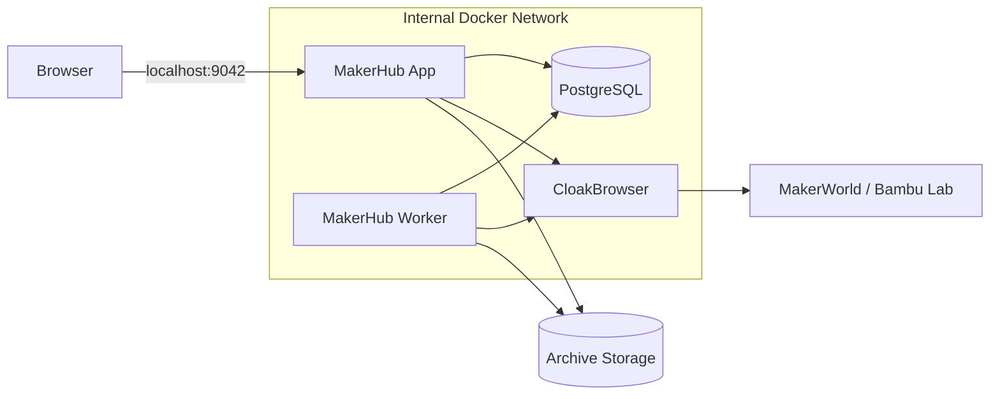
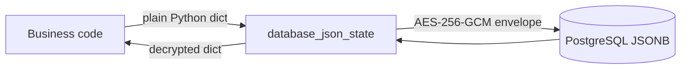

# Architecture

MakerHub separates the interactive web application, long-running workers, persistent state, browser sessions, and archive files into distinct responsibilities.



## Components

### MakerHub App

FastAPI + Vue application responsible for the web UI, authentication, configuration, model browsing, task submission, and lightweight API requests.

### MakerHub Worker

Processes archive jobs and background workflows, including subscriptions, source refreshes, local imports, missing-3MF repair, indexing, and maintenance.

Source refresh work is coordinated by `SourceRefreshTaskManager`. Its persistent projection remains separate from the archive queue so source discovery progress can be resumed and inspected without forcing the large archive queue through a different storage model.

### PostgreSQL

Stores configuration, task state, model indexes, sessions, and business logs. Sensitive state objects are envelope-encrypted before entering PostgreSQL; large queue structures that require PostgreSQL JSONB queries remain queryable.

### CloakBrowser

Maintains isolated browser profiles for MakerWorld global and China-region sessions. MakerHub reuses the real browser session rather than implementing a separate password vault.

### Archive filesystem

Stores 3MF files, model assets, images, attachments, local imports, and generated metadata. Large binary assets do not live inside PostgreSQL.

## State ownership

MakerHub deliberately keeps different long-running workflows in separate state namespaces:

- `ArchiveTaskManager` owns the archive queue and archive task projection;
- `SourceRefreshTaskManager` owns source-refresh progress and recovery state;
- subscription state records recurring sources and discovery cursors;
- account/browser state describes MakerWorld session health and verification gates.

The separation is important: source discovery may finish, pause, or retry independently from actual file downloads. The UI reads projections of these states instead of treating every workflow as one monolithic queue.

## State encryption boundary



Encryption uses a 256-bit key stored outside PostgreSQL. The envelope binds ciphertext to its state key with AES-GCM additional authenticated data, preventing a valid ciphertext from being moved between state namespaces.

Not every JSON state is encrypted. Queue states such as `archive_queue` remain structured JSONB because MakerHub intentionally performs server-side summary queries on them. Credentials and account configuration do not depend on those queries and are protected.

## Network model

The canonical Compose file defines `backend`, an internal network for PostgreSQL and service-to-service traffic, plus `egress` for components that must reach MakerWorld or explicitly configured external services. PostgreSQL is connected only to `backend`.

## Persistence

```text
data/
├── archive/
├── cloakbrowser/
├── config/
└── postgres/

secrets/
├── state-encryption-key
└── state-encryption-previous-keys
```

The `secrets/` directory is excluded from Git. Backups of `data/` are still sensitive because browser profiles can contain active login sessions.
